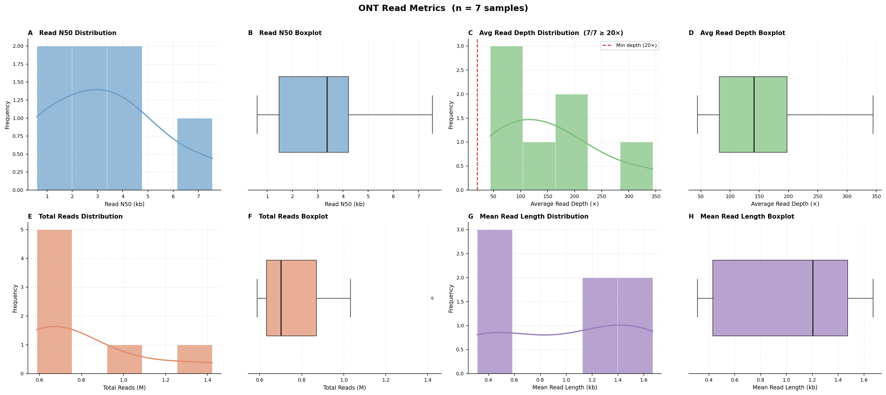

# ont-assembler

🌐 **Language / Langue / Língua:** [English](README.md) | Français | [Português](README_pt.md)

---

Un pipeline Nextflow pour l'assemblage de lectures longues Oxford Nanopore (ONT) en génomes.

**Étapes du pipeline :**
1. **Contrôle qualité des lectures** — métriques par échantillon (N50, profondeur, nombre total de lectures, longueur moyenne) via `seqkit stats`
2. **Filtre de profondeur** — les échantillons en dessous de `--min_read_depth` (défaut : 20×) sont ignorés avec un avertissement
3. **Figure des métriques de lecture** — figure en 8 panneaux (histogrammes + boîtes à moustaches) pour les échantillons retenus
4. **Assemblage** — [Hybracter](https://github.com/gbouras13/hybracter) par défaut, avec [Flye](https://github.com/fenderglass/Flye) et [Raven](https://github.com/lbcb-sci/raven) comme alternatives

Les FASTAs assemblés sont prêts à être transmis directement à [enteric-typer](https://github.com/efosternyarko/enteric-typer).

### Exemple de figure de métriques de lecture (n = 7 échantillons E. coli)



*Figure en 8 panneaux : N50 des lectures, profondeur moyenne, nombre total de lectures et longueur moyenne des lectures — chacun présenté sous forme d'histogramme (gauche) et de boîte à moustaches (droite). La ligne rouge en pointillés dans le panneau C indique le seuil `--min_read_depth` (défaut : 20×) ; les échantillons en dessous sont exclus de l'assemblage.*

---

## Installation

### Prérequis

- [Nextflow](https://nextflow.io) ≥ 23.04
- [Conda](https://conda-forge.org/miniforge/) ou Mamba (recommandé)
- Java 17+ (`java -version`)

### Cloner le dépôt

```bash
git clone https://github.com/efosternyarko/ont-assembler
cd ont-assembler
```

### Hybracter : configuration unique

Hybracter télécharge ses bases de données internes (~2 Go) lors de la première utilisation. Nextflow crée l'environnement conda d'Hybracter lors du premier lancement (les assemblages échoués sont ignorés via `errorStrategy = 'ignore'`). Après ce premier lancement, localisez l'environnement et installez les bases de données :

```bash
# 1. Trouver l'environnement Hybracter créé par Nextflow
HYBRACTER_ENV=$(for e in work/conda/env-*/; do [ -f "${e}bin/hybracter" ] && echo "$e" && break; done)

# 2. Installer les bases de données — Linux / Mac Intel
conda run --prefix "$HYBRACTER_ENV" hybracter install

# 2. Installer les bases de données — macOS Apple Silicon (M1 et supérieur)
CONDA_SUBDIR=osx-64 conda run --prefix "$HYBRACTER_ENV" hybracter install
```

Relancez ensuite le pipeline — les bases de données sont conservées dans l'environnement d'une exécution à l'autre.

---

## Démarrage rapide

```bash
# Hybracter (défaut) — Linux / HPC
nextflow run assemble.nf -c assemble.config -profile conda \
    --input_dir /chemin/vers/fastq/ \
    --outdir    assembly_results_hybracter/

# macOS Apple Silicon (M1 et supérieur)
CONDA_SUBDIR=osx-64 nextflow run assemble.nf -c assemble.config -profile conda,arm64 \
    --input_dir /chemin/vers/fastq/ \
    --outdir    assembly_results_hybracter/ \
    --hybracter_no_medaka true

# Fichier d'échantillons (CSV avec colonnes : id,reads)
nextflow run assemble.nf -c assemble.config -profile conda \
    --samplesheet samples.csv \
    --outdir      assembly_results_hybracter/

# Assembleurs alternatifs
nextflow run assemble.nf -c assemble.config -profile conda \
    --input_dir /chemin/vers/fastq/ \
    --assembler flye \
    --outdir    assembly_results_flye/

nextflow run assemble.nf -c assemble.config -profile conda \
    --input_dir /chemin/vers/fastq/ \
    --assembler raven \
    --outdir    assembly_results_raven/
```

> Chaque assembleur dispose de son propre répertoire de sortie afin que les exécutions parallèles ne s'écrasent jamais.
> Si `--outdir` est omis, le répertoire par défaut est `assembly_results_<assembleur>`.

**Transmettre les FASTAs assemblés à enteric-typer** (avec Hybracter par défaut) :

```bash
nextflow run /chemin/vers/enteric-typer/main.nf -profile conda \
    --input_dir assembly_results_hybracter/all_assemblies/ \
    --outdir    typing_results/
```

---

## Assembleurs

| `--assembler` | Outil | Notes |
|---|---|---|
| `hybracter` | [Hybracter](https://github.com/gbouras13/hybracter) | **Défaut.** Circularise les chromosomes et plasmides. Utilise `--auto` pour estimer automatiquement la taille du chromosome. |
| `flye` | [Flye](https://github.com/fenderglass/Flye) | Mode `--nano-hq` (lectures Guppy 5+ / Dorado Q20+). |
| `raven` | [Raven](https://github.com/lbcb-sci/raven) | Assembleur rapide pour lectures longues non corrigées. Taille du génome non requise. Produit également un graphe d'assemblage GFA. |

---

## Paramètres

| Paramètre | Défaut | Description |
|---|---|---|
| `--input_dir` | `null` | Répertoire de fichiers FASTQ / FASTQ.gz. L'identifiant de l'échantillon correspond au nom du fichier sans extension. |
| `--samplesheet` | `null` | CSV avec colonnes `id,reads` |
| `--outdir` | `assembly_results_<assembleur>` | Répertoire de sortie (le nom de l'assembleur est inclus pour éviter les conflits) |
| `--assembler` | `hybracter` | Outil d'assemblage : `hybracter` \| `flye` \| `raven` |
| `--genome_size` | `5m` | Taille estimée du génome pour le calcul de la profondeur (ex. `5m`, `4500000`) |
| `--min_read_depth` | `20` | Profondeur minimale estimée (×). Les échantillons moins profonds sont ignorés et exclus de la figure. |
| `--chromosome_size` | `2500000` | Hybracter : longueur minimale de contig (pb) pour être considéré comme un chromosome. Ignoré si `--hybracter_auto true`. |
| `--hybracter_auto` | `true` | Laisser Hybracter estimer la taille du chromosome automatiquement (`--auto`). |
| `--hybracter_no_medaka` | `false` | Ignorer le polissage medaka. **Requis sur macOS Apple Silicon** (conflit OpenSSL). Laisser à `false` sur Linux/HPC. |
| `--max_cpus` | `16` | Nombre maximum de CPU par processus |
| `--max_memory` | `128.GB` | Mémoire maximum par processus |

---

## Fichiers de sortie

```
assembly_results_<assembleur>/
│
│  ── Contrôle qualité des lectures ────────────────────────────────────────────
│
├── ont_read_qc/
│   └── {échantillon}_read_stats.tsv
│         Métriques de lecture par échantillon (TSV, une ligne de données) :
│           sample_id       — nom de l'échantillon
│           num_reads       — nombre total de lectures
│           total_bases     — nombre total de bases séquencées
│           read_N50        — N50 des lectures (pb)
│           mean_length     — longueur moyenne des lectures (pb)
│           mean_quality    — score de qualité Phred moyen
│           gc_pct          — teneur en GC (%)
│           estimated_depth — total_bases / taille_génome (×)
│
├── ont_plot_metrics/
│   ├── ont_read_metrics.png
│   │     Figure en 8 panneaux pour les échantillons passant le filtre de profondeur :
│   │       A  Histogramme N50     B  Boîte à moustaches N50
│   │       C  Histogramme profondeur   D  Boîte à moustaches profondeur
│   │           (ligne pointillée verticale = seuil --min_read_depth)
│   │       E  Histogramme total lectures   F  Boîte à moustaches total lectures
│   │       G  Histogramme longueur moyenne   H  Boîte à moustaches longueur moyenne
│   └── ont_read_metrics_summary.tsv
│         TSV fusionné de toutes les lignes read_stats des échantillons retenus
│
│  ── Assemblage (hybracter — défaut) ──────────────────────────────────────────
│
├── all_assemblies/                          ← à transmettre à enteric-typer
│   └── {échantillon}.fasta
│
├── hybracter_output/
│   ├── {échantillon}_chromosome.fasta
│   ├── {échantillon}_plasmid.fasta
│   ├── {échantillon}_incomplete.fasta
│   ├── {échantillon}_hybracter_summary.tsv
│   └── {échantillon}_flye.gfa             — graphe d'assemblage Flye (visualisable dans Bandage)
│
│  ── Assemblage (flye / raven) ────────────────────────────────────────────────
│
├── assemblies/
│   └── {échantillon}.fasta
│
├── flye_assembly/            (si --assembler flye)
│   ├── {échantillon}_flye_info.txt
│   └── {échantillon}_flye.gfa
│
├── raven_assembly/           (si --assembler raven)
│   └── {échantillon}_raven.gfa
│
├── assembly_timing/
│   └── {échantillon}_timing.tsv
│
└── assembly_timing_summary.tsv
│
│  ── Informations du pipeline ──────────────────────────────────────────────────
│
└── pipeline_info/
    ├── timeline.html
    ├── report.html
    └── dag.svg
```

> **Hybracter : assemblages complets et incomplets.**
> Le fichier `{échantillon}_hybracter_summary.tsv` indique si chaque assemblage est complet
> (chromosome circularisé) ou incomplet (contigs brouillon).

---

## Profils d'exécution

| Profil | Cas d'utilisation |
|---|---|
| `conda` | Poste de travail local avec conda/mamba |
| `mamba` | Identique à conda mais avec résolution d'environnement plus rapide |
| `arm64` | **À ajouter sur Apple Silicon (M1 et supérieur)** — force les environnements conda osx-64 via Rosetta 2 |
| `docker` | Local avec Docker Desktop |
| `singularity` | Cluster HPC avec Singularity/Apptainer |
| `slurm` | Exécuteur HPC SLURM (à combiner avec un autre profil : `-profile conda,slurm`) |
| `pbs` | Exécuteur HPC PBS/Torque |

### Exemple HPC

```bash
nextflow run assemble.nf -c assemble.config -profile singularity,slurm \
    --input_dir /chemin/vers/fastq/
```

### macOS Apple Silicon

```bash
CONDA_SUBDIR=osx-64 nextflow run assemble.nf -c assemble.config -profile conda,arm64 \
    --input_dir /chemin/vers/fastq/ \
    --hybracter_no_medaka true
```

> **`--hybracter_no_medaka true` est requis sur macOS Apple Silicon.**
> Hybracter utilise [medaka](https://github.com/nanoporetech/medaka) pour le polissage par consensus
> en réseau de neurones lors de la dernière étape d'assemblage. Medaka dépend d'**OpenSSL 1.1.x**,
> ce qui entre en conflit avec les bibliothèques OpenSSL 3.x présentes dans les environnements conda
> macOS — même sous émulation Rosetta 2 (osx-64). Passer `--hybracter_no_medaka true` ignore cette
> étape de polissage : Hybracter effectue tout de même l'assemblage Flye, la récupération des plasmides
> avec Plassembler et la circularisation du chromosome.
>
> **Si le polissage medaka est nécessaire**, exécutez le pipeline sur Linux ou un cluster HPC.
> Avec un basecalling Dorado haute précision (lectures Q20+), l'impact de l'omission du polissage
> medaka sur la précision du consensus est généralement minimal.

> `CONDA_SUBDIR=osx-64` est requis sur Apple Silicon pour garantir la création d'environnements
> conda Rosetta 2 (x86_64). Les environnements sont mis en cache après le premier lancement.

---

## Nettoyage

```bash
# Supprimer les fichiers temporaires Nextflow (sans danger une fois les résultats vérifiés)
rm -rf work/ .nextflow/ .nextflow.log*
```

Conservez `work/` si vous souhaitez utiliser `-resume` pour reprendre depuis un point de contrôle.

---

## Citation

Si vous utilisez ont-assembler, veuillez également citer les outils sous-jacents :

- **Hybracter** : Bouras et al. (2024) Microbial Genomics 10(5)
- **Flye** : Kolmogorov et al. (2019) Nature Biotechnology 37:540–546
- **Raven** : Vaser & Šikić (2021) Nature Computational Science 1:332–336
- **seqkit** : Shen et al. (2016) PLOS ONE 11(10):e0163962
- **Nextflow** : Di Tommaso et al. (2017) Nature Biotechnology 35:316–319
